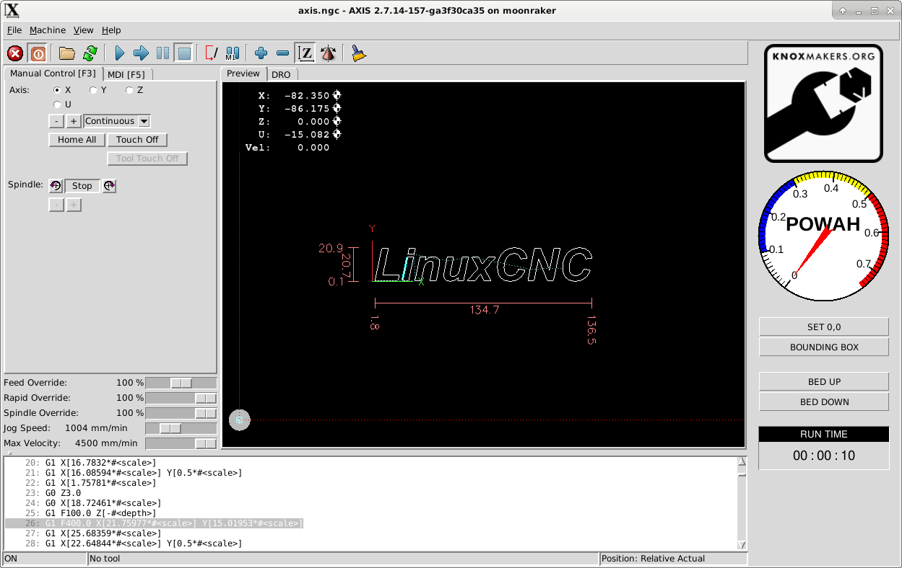

#  GUI

LinuxCNC config

---

# Install

Install LinuxCNC in your favorite method.
We used the Debian 9 Stretch ISO from http://linuxcnc.org/downloads/

Install the comp file
`halcompile --install laserfreq.comp`

Copy the config directory to where your linuxcnc configs live.
For us that is /home/moonraker/linuxcnc/configs/moonraker

If you use a different directory you will need to edit the ini file to match.

Place the files from nc_files into your PROGRAM_PREFIX directory as listed in the ini file.

Start LinuxCNC using the config.

# Thanks

This config is largely based on https://github.com/bjj/2x_laser
